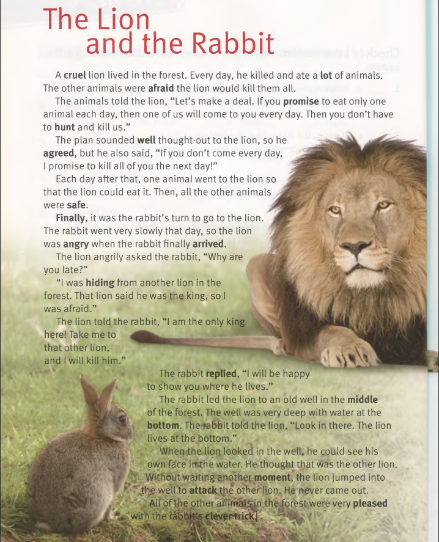

+++
author = "Devin"
title = "en"
date = "2023-12-18"
description = "en"
categories = [
    "en"
]
tags = [
    "en"
]

+++


# speak/listen

```
I am very happy and grateful to have hosted two English Corners last weekend. 
It was a wonderful opportunity for people to practice their English skills, learn from each other, and make new friends. 
I enjoyed listening to your stories, opinions, and insights on various topics. 
You all showed great enthusiasm, curiosity, and respect for each other. 
I appreciate your participation and feedback. 
Thank you for joining me in this fun and rewarding experience. 
I hope to see you again in the upcoming English Corners. 
Keep up the good work and stay positive!

grateful	感谢，受欢迎的
insights	见解，洞察力
enthusiasm	热情(ɪnˈθuːziæzəm)
curiosity	好奇心，求知欲，珍品
participation	参加(pɑːrˌtɪsɪˈpeɪʃ(ə)n)
feedback	反馈意见
rewarding	值得，有意义的，奖赏
upcoming	即将到来的

```

```
Our topic for tonight’s live stream: 
👉Trust
Trusting people means believing that they are dependable, reliable, honest, and act with good intentions.
To trust someone you have to know that they will do the things they say they will.
How to trust people?
Let’s discuss this important topic!
We’ll start at 8pm. 
See you tonight!
intention	意图，目的
```

```
Never assume that you are stuck with the way things are. Life changes every single moment, and so can you.
assume	假定，假设，认为；装出，做出；承担，就职；呈现，具有；夺取，篡夺
stuck	陷入困境，停滞不前的
way		方法，习惯，状况
```


---

---

---

# vocabulary

```
The woman was afraid of what she saw.
A: The food is very good in that restaurant. B: I agree with you.
She didn’t do her homework, so her father is angry.
The bus always arrives at the corner of my street at 4:00.
The man with the sword attacked the other man first.
The bottom of my shoe has a hole in it.
The clever boy thought of a good idea.
The cruel* man yelled at his sister.	/ˈkruːəl/ 残酷的，残忍的；引起痛苦的
He finally crossed the finish line after five hours of running.
The other children will hide while you count to 100

Long ago, people hunted* with bows* and arrows*.		捕猎/弓/箭头
There are a lot* of apples in the basket*.			许多/篮子
The Canadian flag has a maple* leaf* in the middle of it.	枫树/叶子
I was only a few moments late for the meeting.
She was pleased* with the phone call she received.		高兴，满意
He promised to return my key by tomorrow.
She asked him what time his meeting was. He replied, “at three.”
Put on your seat* belt* in the car to be safe.	座位/安全带
His card trick* really surprised us.		骗局，恶作剧，把戏
The couple* can dance quite* well.			夫妇/非常地，同意


```



