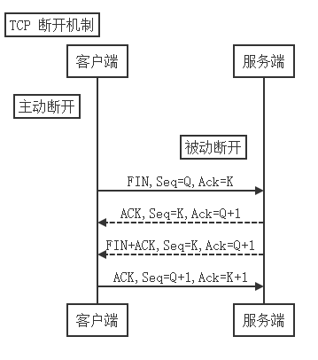

+++
author = "Devin"
title = "面试"
date = "2023-11-06"
description = "面试"
categories = [
    "面试"
]
tags = [
    "面试"
]

+++

1. rtt线程间同步，访问共享资源

同步方式有很多种，核心思想：再访问临界区的时候只允许一个(或一类)线程运行。

进入/退出临界区的方式有很多种：

1）rt_hw_interrupt_disable()	进入		rt_hw_interrupt_enable() 	退出
2）rt_enter_critical()			进入		rt_exit_critical() 			退出

尽量少使用这种关闭全局中断的方式进行线程同步

 

1）信号量(轻型内核对象)，常使用在线程与线程

 

中断与线程的同步，例如FinSH线程，开始线程没有信号量资源，处于挂起状态，当从硬件I/O口读取数据后，并确认中断以清除中断源，然后释放一个信号量来唤醒响应的线程做后续的数据处理

Note：中断与线程间的互斥不能采用信号量，而应采用开关中断方式

 

互斥量，由于信号量保护临界区会导致无界优先级反转的问题而提出，支持递归访问能防止线程优先级翻转，互斥量只能由持有线程释放

 

优先级反转：低优先级的任务持有一个被高优先级任务所需要的共享资源，高优先级任务由于资源缺乏而受阻，直到低优先级释放资源。如果此时有个中优先级的任务并不需要那个共享资源，那中优先级任务反而超过这两个任务而获得CPU时间

 

死锁：并行线程P1,P2分别占用资源R1,R2，继续执行时都需要获得对方的资源才能退出，造成死锁

 

2）在RTT系统中互斥量可以解决优先级翻转问题，采用优先级继承协议，

Note

 

注：在获得互斥量后，请尽快释放互斥量，并且在持有互斥量的过程中，不得再行更改持有互斥量线程的优先级，否则可能人为引入无界优先级反转的问题。

3）事件集，利用事件集完成一对多、多对多的线程间同步，仅用于同步，不提供数据传输功能

 

2. 线程间通信

1）邮箱，开销低，效率高，每封邮箱只能装4字节，在32位系统下可以传指针，线程或者中断服务例程发送4字节邮箱，一个或多个线程从邮箱中接收并处理

2）消息队列，接收来自线程或中断服务例程中不固定长度的消息，是一种异步的通信方式，先进先出原则

3）信号

 

3. SPI IIC USART UART CAN ETH USB

 

串行的单工（单方向传送，一根数据线）、半工（分时双向进行，一根数据线）、全双工（发送和接收可以通信进行，二根数据线）

 

SPI

四根线 CS SCLK MOSI MISO 由于只有一根时钟线，是一种同步通信方式，采用主从模式

工作流程：首先片选信号选中Slave设备，一般为低电平片选有效，被选中的Slave设备能被Master设备访问，输出串行同步时钟极性(CPOL)和相位(CPHA)，控制着两个SPI设备间何时数据交换以及何时对接到收到的数据进行采样

数据的采集可以是时钟空闲为低电平时（时钟信号上升/下降两种）时钟空闲为高电平时（时钟信号上升/下降两种），一共四种，具体那种需要看芯片数据手册

 

UART

串行异步通信，字符与字符之间的间隙是任意的，字符中的每个位间隙是固定的

每个字符都要用起始位和停止位作为开始和结束

 

USART

串行同步通信，1次传送1组数据，在开始处用同步字符SYN（1~2个），检测到约定同步字符后，下面就连续、顺序地发送和接收数据

 

IIC（芯片与芯片之间的通信），一主多从，同步通信

两根线，SCL时钟，数据SDA

读写数据

空闲状态：SCL为高，SDA为高

起始信号：SCL为高，SDA从高到低

停止信号：SCL为高，SDA从低到高

应答信号根据前面发送者是谁，主机发送则从机应答，反之亦然。（0为收到，1为没收到或接收完成）

可以看出从机应答0为收到，1为没收到，主机应答1为接收完成

 

CAN（控制区局域网）

最初是为了减少铜线的长度，多为汽车使用，单片机与CAN收发芯片通信

两根线，差分信号H,L

发送低电平两根线分别为3.5v 1.5v，电压差是2v，显性电平，表示逻辑0

发送高电平两根线分别为2.5v 2.5v，电压差是0v，隐性电平，表示逻辑1

差分信号，双绞线缠绕，减少干扰，适合远距离传输 1Km

起始位：1位

识别位：11位ID，CANOPEN中，前4位是功能码，后7位是节点号

RTR位：区分数据帧(0)/远程请求帧(1)，

控制码：6位，控制数据长度，第一位是ILDE位，用来控制识别位为标准帧(11,逻辑0)/扩展帧(29,逻辑1)

空闲位：0

DLC：4位，代表数据字节大小，10001代表是1个字节8位，1000代表8个字节64位

CRC：16位，循环冗余校验位

CRC界定符：1位，逻辑1，隔离后面的数据

ACK码：第一位ACK确认槽，发送端发送逻辑1，接收端回复逻辑0表示应答，第二位ACK界定位，逻辑1

结束位：7位，都是逻辑1

两个ECU同时发送数据，ID帧最小的通过总线传输，大的停止传输，称为帧仲裁

4. 一个新板子出来后，怎么调试

1）检查电压是否正常，电源芯片是否未工作,电源是否对地短路

2）检查复位信号是否正常

3）

 

5. 电机控制梯形加减速，S型加减速

已知：入口速度V0、巡航速度V、刹车速度V1（对于加工机，不允许存在减速后匀速的情况）

1）全巡航，入口速度和巡航速度 巡航速度和刹车速度 相同

2）纯加速，加速长度(V1^2-V0^2)/2a，加速长度等于移动长度，入口速度小于刹车速度

3）纯减速，减速长度等于移动长度，入口速度大于刹车速度

4）加速后巡航，刹车速度大于入口速度，巡航速度等于刹车速度

5）巡航后减速，刹车速度小于入口速度，巡航速度等于入口速度

6）加速、巡航、减速，加速长度+减速长度小于移动长度

7）加速后马上减速，加速长度+减速长度大于移动长度，先算出减速前的速度再算加速距离

 

5.Modbus485串行通信实现不定长数据的传输

通过判断串口总线状态是否为ILDE来确认，为ILDE说明发送完成了

 

6. PID中P、I、D各代表什么意思

比例（对等控制）、积分（消除稳态误差）、微分（反向作用）

P值：与目标很接近了，只需要小小输出就行了

D值：输出和输入相等，对象没有产生波动，不做调整

 

7. hardfault产生原因

硬错误，对于Cortex-M内核，异常有HardFault、MemManage、BusFault、UsageFault

可能的原因：数组越界、野指针、未初始化硬件却开始操作，或无中断服务函数、任务堆栈溢出

BusFault是由于AHB总线在传输数据时出错，尝试访问无效内存区域、设备没有准备好接收数据（没有初始化SDRAM控制器尝试访问SDRAM）

 

8. 程序存储的段

.txt 代码段  		函数代码

.data 数据段			已初始化全局变量(包括全局静态变量)和局部静态变量

.bss段				未初始化全局变量(包括全局静态变量)和局部静态变量

.rodata 只读数据段	全局常量(const)、字符串常量

堆					动态分配数据

栈					局部变量

 

9. modbus协议

主发送命令

| 从设备地址 | 功能码 | 起始寄存器地址 | 寄存器个数 | CRC校验   |
| ---------- | ------ | -------------- | ---------- | --------- |
| 1Byte      | 1Byte  | 2Byte，MSB     | 2Byte,MSB  | 2Byte,LSB |

从应答

| 从设备地址 | 功能码 | 数据长度 | 寄存器个数 | CRC校验   |
| ---------- | ------ | -------- | ---------- | --------- |
| 1Byte      | 1Byte  | 1Byte    | 2Byte,MSB  | 2Byte,LSB |

 

功能码：03 读从机

地址码	功能码	寄存器地址	寄存器个数	CRC校验

8bit		 8bit		16bit		16bit	 16bit

主机发送：  01    03    00 00    00 02    C4 0B

地址码	功能码	字节数 		数据		CRC校验

从机应答：01	 03 		04 	 00 01 00 02  	  2A 32

 

功能码：10 写从机

地址码	功能码	寄存器地址	寄存器个数	字节数 		 数据N			   CRC校验

Tx:	 01    10		 00 00   00 04    08   00 0A 00 14 00 1E 00 28 		4C 61

地址码	功能码	寄存器地址	寄存器个数	CRC校验

Rx:	01     10   00 00     00 04    C1 CA

 

10. 系统启动之后首先执行的任务是什么？

设置堆区和栈区的大小，设置栈顶指针，复位中断服务函数、hardfault中断服务函数等等，初始化系统时钟，跳转到main函数

 

11. 进程和线程的区别

根本区别：进程是操作系统资源分配的基本单位，线程是处理器任务调度和执行的基本单位

资源开销：每个进程都有独立的代码和数据空间，切换开销大，同一类线程共享代码和数据空间

包含关系：线程是进程的一部分

内存分配：同一进程的线程共享该进程的地址空间和资源，而进程之间的地址空间和资源是相互独立的

执行过程：每个独立的进程有程序运行的入口、顺序执行和程序出口，线程不能，必须依存在应用程序中

 

12. rtt的网络通信使用的那个协议？

Lwip，是瑞典计算机科学院 (SICS) 的 Adam Dunkels 开发的一个小型开源的 TCP/IP 协议栈，保持TCP协议主要功能的基础上减少对RAM的占用

 

数据接收

数据发送

三次握手

1. 客户端发送含 SYN 标志的报文，表示要建立一个连接， 初始化连接的同步序号 seq；

 

2. 服务器端接收到含 SYN 的报文后， 也将一条含 SYN 标志报文， 作为 ACK 回复给客户端， 一则表示收到客户端创建连接的请求，二则表示服务端也同时创建与客户端的连接；

 

3. 客户端收到回复后再发送一条 ACK 报文， 表示收到服务端的创建连接请求。

不论是客户端还是服务端， 创建连接发送数据的时候数据包中都包含一个初始化序列号 seq， 对方收到数据并回复时会将收到的 seq 加 1 作为 ACK 的数据。 这样发送端就可以判断是不是对本次数据的回复。 以后每次发数据都会在前一次 seq 的基础上 +1 作为本次的 seq (注意， 建立连接和断开连接时 seq 是加 1， 传输应用数据时 seq 加的是上次发送的数据长度 )。

 

四次挥手

1. 已经建立连接的其中一段想要断开连接，称为主动关闭方。其发送一个含 FIN 标志、seq 值（假设为 Q）和 ACK 值（假设为 K， 来自上次收到的 seq）的报文到连接对方，称为被关闭方；

 

2. 被关闭方收到含 FIN 标志的报文后，将 K 作为 seq 值，Q 加 1 后作为 ACK 值回复给主动关闭方。

 

3. 被关闭方同时检查自身是否还有处理完的数据包，若没有则开始启动关闭操作，身份转变为主动关闭方，同样发送一个含 FIN、seq（值仍为 K）和 ACK 值（值仍为 Q+1）初始化的报文到连接对方。

 

4.原主动关闭方转变为被关闭方，收到报文后，回复一条 seq 为 Q+1，ACK 为 K+1 的报文。至此，完成 TCP 连接的断开。

 

13. 四次握手中，客户端第一次主动断开连接后，服务端接收到断开信号后还能向客户端发送数据吗？为什么？

能，服务端接收到断开信号后会发送应答信号给客户端，并且检查自身是否还有数据需要处理，没有就启动关闭操作，变为主动关闭方，发送FIN标志报文给客户端

 

14. linux下进程间通信方式

1）无名管道，速度慢，容量有限，半双工，父子进程之间的通信，数据量的限制

2）有名管道，任何进程间都能通讯，但速度慢

3）信号量，计数器，非负整数，当一个进程访问资源时，为零会进入休眠

4）消息队列，FIFO的数据结构，每个msg都有优先级，根据优先级放入队列适当位置，异步通信，发送者和接收者不需要同时在线

5）共享内存，多个进程访问同一块内存区域，数据传输速度快，数据不需要在进程间复制，有数据同步/完整性/安全灯问题

6）Socket，tcp、udp

 

15. linux下并发与竞争

1）原子操作

2）自旋锁

3）信号量

4）互斥锁

5）禁止抢占

在Linux系统中，原子操作、自旋锁、信号量、互斥锁和禁止抢占是用于处理并发和竞争的常用机制。它们各自有其优缺点和使用场景。

1. 原子操作：
   - 优点：原子操作是原子的，即在执行过程中不会被其他操作中断，因此适用于在多线程环境中保证数据的一致性和完整性。
   - 缺点：在处理复杂逻辑时，原子操作可能会变得复杂，并且可能会消耗更多的CPU资源。
   - 使用场景：适用于在多线程环境中保证数据的一致性和完整性，例如更新计数器或状态变量等。
2. 自旋锁：
   - 优点：自旋锁是一种非阻塞锁，当获取锁失败时，它会一直循环检查锁是否可用。这对于短时间内的资源争用很有用，因为它不会引起进程切换，从而减少了开销。
   - 缺点：如果锁被持有的时间较长，自旋锁会持续消耗CPU资源，导致资源浪费。
   - 使用场景：适用于短时间内对资源的争用，例如中断处理程序或计时器等。
3. 信号量：
   - 优点：信号量可以用于控制对共享资源的访问次数，从而实现进程间的同步和通信。此外，它还支持计数功能。
   - 缺点：相对于其他同步机制，信号量的实现较为复杂。
   - 使用场景：适用于需要控制对共享资源访问次数的场景，例如在生产者-消费者问题中。
4. 互斥锁：
   - 优点：互斥锁是阻塞锁，当获取锁失败时，进程会被阻塞直到获得锁为止。这样可以避免CPU资源的浪费。
   - 缺点：如果锁被持有的时间较长，会导致进程长时间被阻塞，从而影响系统性能。
   - 使用场景：适用于长时间对资源的独占性使用，例如文件读写或网络连接等。
5. 禁止抢占：
   - 优点：禁止抢占可以确保在特定时间内只有一个进程可以执行关键代码段，从而避免竞争条件的发生。
   - 缺点：禁止抢占会导致其他进程长时间等待，从而影响系统性能和响应能力。
   - 使用场景：适用于需要保证关键代码段的执行不被中断的场景，例如实时系统或金融交易等。

综上所述，各种同步机制都有其优缺点和使用场景。在实际应用中，需要根据具体需求选择合适的同步机制来处理并发和竞争问题。

 

16. 大小端

大端模式（Big-Endian）是指数据的高字节保存在内存的低地址中，而数据的低字节保存在内存的高地址中。

小端模式（Little-Endian）则是将数据的高字节保存在内存的高地址中，而数据的低字节保存在内存的低地址中。

 

17.TCP流程

Client：Socket、connect、send、recv、close

Server：Socket、bind、listen、accept、recv、send、close
