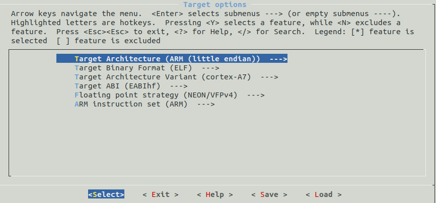
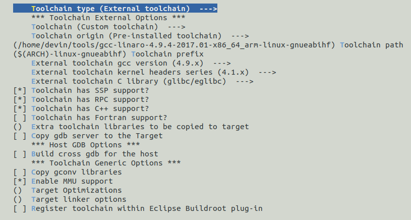
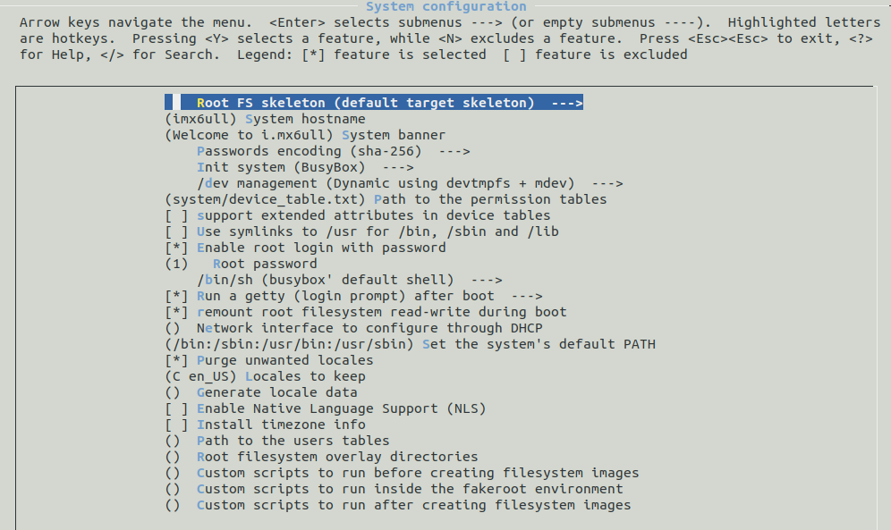
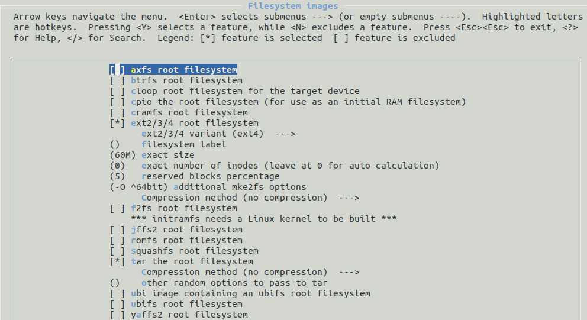

+++
author = "Devin"
title = "根文件制作"
date = "2023-11-06"
description = "基于buildroot或者busybox制作根文件"
categories = [
    "根文件系统"
]
tags = [
    "根文件"
]

+++


# 一.buildroot

## 1.下载[buildroot源码](https://buildroot.org)

## 2.图形配置

```
make menuconfig
```









```
sudo make
```

# 二.下载[busybox](http://busybox.net/downloads/)

```
make menuconfig
```

## 1.配置交叉编译器

Busybox Settings
General Configuration
Build Options
*Build Busybox as a static binary
(arm-linux-)Cross Compiler prefix //交叉编译器前缀 arm-linux-

## 2.命令

```
make
```

## 3.命令

```
make install
```

## 4.在_install/ 文件夹下有文件系统的 bin linuxrc sbin usr 将它们拷贝过去

## 5.mkdir dev etc mnt proc var tmp sys root

## 6.将gcc下面的lib文件拷贝到文件系统中

需要是下面的库文件

```
debug              libatomic.so.1       libgfortran.a         libgomp.spec        libssp.so                   libsupc++.a
ldscripts          libatomic.so.1.2.0   libgfortran.so        libitm.a            libssp.so.0                 libubsan.a
libasan.a          libcilkrts.a         libgfortran.so.4      libitm.so           libssp.so.0.0.0             libubsan.so
libasan_preinit.o  libcilkrts.so        libgfortran.so.4.0.0  libitm.so.1         libstdc++.a                 libubsan.so.0
libasan.so         libcilkrts.so.5      libgfortran.spec      libitm.so.1.0.0     libstdc++fs.a               libubsan.so.0.0.0
libasan.so.4       libcilkrts.so.5.0.0  libgomp.a             libitm.spec         libstdc++.so
libasan.so.4.0.0   libcilkrts.spec      libgomp.so            libsanitizer.spec   libstdc++.so.6
libatomic.a        libgcc_s.so          libgomp.so.1          libssp.a            libstdc++.so.6.0.24
libatomic.so       libgcc_s.so.1        libgomp.so.1.0.0      libssp_nonshared.a  libstdc++.so.6.0.24-gdb.py

```

## 7.rm lib/*.a 

删除静态库

## 8.arm-linx-strip lib/* 

删除不必要的调式符号

这两步动作就是为了缩小文件系统lib的体积

## 9.添加系统启动文件

在etc下添加文件 inittab 文件内容如下

```
#this is run first except when booting in single-user mode.
::sysinit:/etc/init.d/rcS

# /bin/sh invocations on selected ttys

# start an "askfirst" shell on the console (whatever that may be)

::askfirst:-/bin/sh

# stuff to do when restarting the init process

::restart:/sbin/init

# stuff to do before rebooting

::ctrlaltdel:/sbin/reboot
```

## 10.在etc下添加文件fstab，文件内容如下：

```
#device mount-point type options dump fsck order
proc /proc proc defaults 0 0
tmpfs /tmp tmpfs defaults 0 0
sysfs /sys sysfs defaults 0 0
tmpfs /dev tmpfs defaults 0 0
```

这里我们挂载的文件系统有三个proc、sysfs和tmpfs。在内核中proc和sysfs默认都支持，而tmpfs
是没有支持的，我们需要添加tmpfs的支持
修改内核配置：
$ make menuconfig

```
File systems --->
	Pseudo filesystems --->
		[*] Virtual memory file system support (former shm fs)
		[*] Tmpfs POSIX Access Control Lists
```

重新编译内核
在etc下创建init.d目录，并在init.d下创建rcS文件，rcS文件内容为：

```
#!/bin/sh

# This is the first script called by init process

/bin/mount -a
echo /sbin/mdev > /proc/sys/kernel/hotplug
/sbin/mdev -s
```

为rcS添加可执行权限：
$ chmod +x init.d/rcS
在etc下添加profile文件，文件内容为：

```
#!/bin/sh
export HOSTNAME=coco
export USER=root
export HOME=root
export PS1="[$USER@$HOSTNAME \W]\# "
PATH=/bin:/sbin:/usr/bin:/usr/sbin
LD_LIBRARY_PATH=/lib:/usr/lib:$LD_LIBRARY_PATH
export PATH LD_LIBRARY_PATH
```

